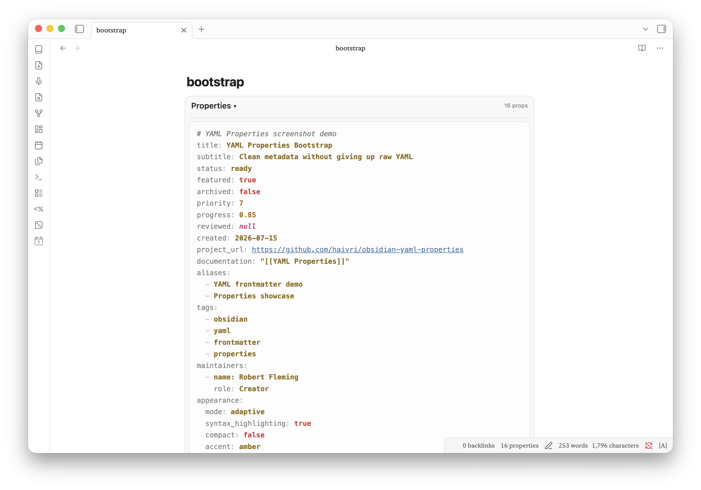
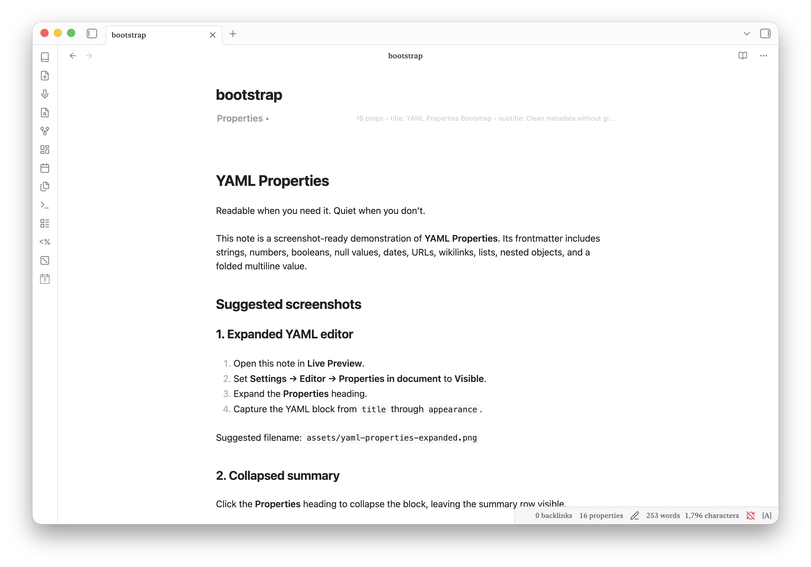
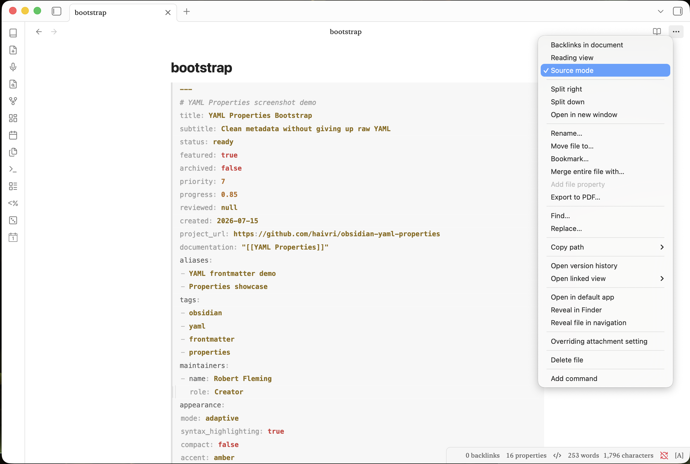
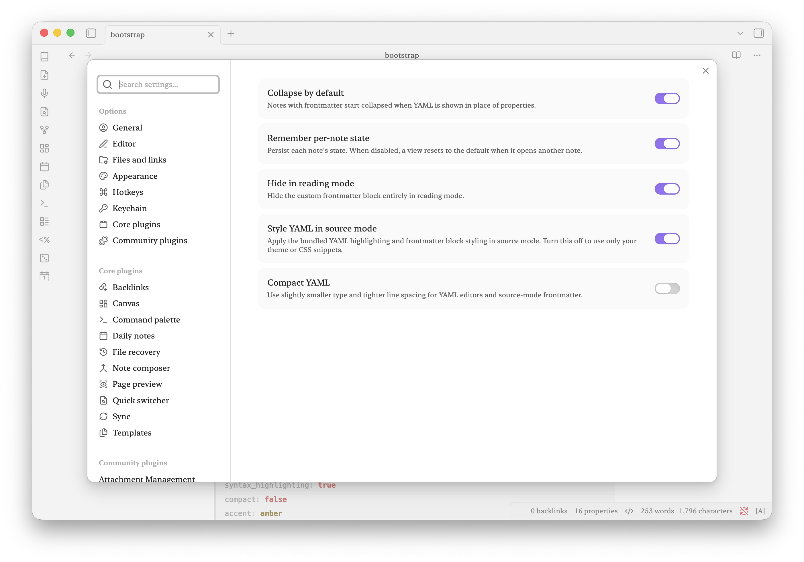

# YAML Properties

Edit Obsidian Properties as readable, syntax-highlighted YAML frontmatter, then collapse the block when you want it out of the way.

YAML Properties is for people who want the portability and full expressiveness of raw YAML without giving up a clean writing view. It replaces the in-note Properties editor with an editable YAML block in Live Preview, shows a highlighted read-only block in Reading view, and leaves normal Source mode available.

<p align="center">
  
</p>

## Features

- Edit raw YAML frontmatter directly in Live Preview.
- Syntax highlighting for keys, strings, numbers, booleans, nulls, tags, links, comments, and punctuation.
- Collapse Properties to a compact summary row.
- Choose whether notes start collapsed and whether state is remembered per note.
- Hide the custom YAML block in Reading view.
- Bundled source-mode YAML styling with an optional compact layout.
- Works on desktop and mobile without network access or external services.

Your notes remain plain Markdown. The plugin does not add proprietary metadata or modify YAML unless you edit it.

## See it in action

### Collapse frontmatter into a quiet summary

Keep useful metadata one click away without letting it dominate the note.

<p align="center">
  
</p>

### Keep YAML readable in Source mode

The bundled styling makes keys recede while strings, numbers, booleans, dates, links, lists, and nested values remain easy to scan.

<p align="center">
  
</p>

### Choose the behavior that fits your vault

Control the default collapse state, remember individual notes, hide frontmatter in Reading view, style Source mode, or switch to a compact layout.

<p align="center">
  
</p>

## Usage

1. Set **Settings → Editor → Properties in document** to **Visible** for the collapsible YAML editor. The bundled highlighting also supports the **Source** option.
2. Open a note containing YAML frontmatter.
3. Click the **Properties** heading to expand or collapse the YAML block.
4. Edit YAML in Live Preview. Changes save after a short pause, on blur, or with `Ctrl/Cmd+Enter`.

Use the command **YAML Properties: Toggle frontmatter** to toggle the active note from the command palette.

## Settings

- **Collapse by default** — Start frontmatter collapsed.
- **Remember per-note state** — Restore the last state of each note.
- **Hide in reading mode** — Hide the custom frontmatter block in Reading view.
- **Style YAML in source mode** — Enable the bundled source-mode highlighting. Disable this to let your theme or snippets handle Source mode.
- **Compact YAML** — Use smaller type and tighter line spacing.

## Customizing the colors

Themes and CSS snippets can override the plugin's public variables. For example:

```css
body {
  --yaml-properties-key: var(--text-muted);
  --yaml-properties-string: #a8d8a8;
  --yaml-properties-number: #e6b566;
  --yaml-properties-boolean: #e06c75;
  --yaml-properties-null: #c678dd;
  --yaml-properties-anchor: #b8a1e3;
  --yaml-properties-link: #61afef;
  --yaml-properties-date: #d19a66;
  --yaml-properties-tag: #c678dd;
  --yaml-properties-comment: var(--text-faint);
  --yaml-properties-punctuation: var(--text-faint);
  --yaml-properties-background: var(--background-secondary);
  --yaml-properties-background-active: var(--background-secondary-alt);
  --yaml-properties-rail: var(--background-modifier-border);
  --yaml-properties-rail-active: var(--interactive-accent);
}
```

Because these are ordinary CSS custom properties, users have final control without editing the plugin files.

## Installation

### Community Plugins

Once accepted, install **YAML Properties** from **Settings → Community plugins → Browse**.

### Manual installation

Copy `main.js`, `manifest.json`, and `styles.css` from a release into:

```text
<vault>/.obsidian/plugins/yaml-properties/
```

Then reload Obsidian and enable **YAML Properties** under Community plugins.

## Development

Requires Node.js 18 or newer.

```bash
npm install
npm run dev
```

Run `npm run build` for a production build.

## Release checklist

1. Update `minAppVersion` in `manifest.json` if compatibility has changed.
2. Run `npm version patch`, `npm version minor`, or `npm version major`. The script updates `manifest.json` and `versions.json`; push the numeric tag without adding a `v` prefix.
3. Push the tag. The release workflow builds the plugin and attaches `main.js`, `manifest.json`, and `styles.css` to a GitHub Release.
4. For the initial Community Plugins submission, sign in at [community.obsidian.md](https://community.obsidian.md), link GitHub, and submit the repository URL under **Plugins → New plugin**.

## Privacy

YAML Properties does not collect telemetry, make network requests, or send vault data anywhere.

## Acknowledgements

YAML Properties was conceived, directed, and tested by Robert Fleming. Its implementation, refinement, documentation, and release engineering were completed in close collaboration with OpenAI Codex, powered by GPT-5.

Robert provided the vision and product decisions; AI assistance was invaluable in turning that vision into a polished community plugin. YAML Properties would not exist in its present form without that human–AI collaboration.

## License

[MIT](LICENSE)
